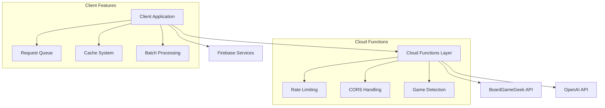

# API Integrations

## Architecture Overview

The application uses a hybrid architecture combining Firebase Cloud Functions with client-side API integration:

1. Cloud Functions Layer
   - Handles BGG API communication
   - Provides game detection capabilities
   - Implements rate limiting and CORS
   - Manages API response caching

2. Client Layer
   - Implements sophisticated caching
   - Handles request queuing
   - Provides batch processing
   - Manages error handling and retries



## Firebase Cloud Functions

### Caching Architecture

The system implements a Firestore-based caching system to optimize API requests and handle rate limiting:

```typescript
interface CacheEntry {
  data: string;      // XML response data
  timestamp: number; // Entry creation time
  endpoint: string;  // API endpoint
  params: Record<string, any>; // Request parameters
}

// Cache configuration
const CACHE_TTL = 24 * 60 * 60 * 1000; // 24 hours
const CACHE_COLLECTION = 'api-cache';
```

### Endpoints

1. Game Search Function
```typescript
export const bggSearch = functions
  .runWith({
    timeoutSeconds: 60,
    memory: "256MB",
    minInstances: 0
  })
  .https.onRequest(async (request, response) => {
    // Checks Firestore cache first
    // Falls back to BGG API with retry mechanism
    // Implements automatic cache population
    // Returns XML response
  });
```

2. Game Details Function
```typescript
export const bggGameDetails = functions
  .runWith({
    timeoutSeconds: 60,
    memory: "256MB",
    minInstances: 0
  })
  .https.onRequest(async (request, response) => {
    // Checks Firestore cache first
    // Falls back to BGG API with retry mechanism
    // Implements automatic cache population
    // Returns XML response
  });
```

3. Cache Cleanup Function
```typescript
export const cleanupExpiredCache = functions.pubsub
  .schedule('every 24 hours')
  .onRun(async () => {
    // Removes expired cache entries
    // Maintains optimal cache size
    // Logs cleanup operations
  });
```

3. Image Analysis Function
```typescript
export const analyzeImage = functions.https.onRequest(async (req, res) => {
  // Handles image analysis using Vision API
  // Processes annotations using GameDetectionService
  // Returns detected games with confidence scores
});
```

### Caching and Rate Limit Handling

The system implements a sophisticated caching and rate limiting strategy:

1. Cache-First Approach
```typescript
async function handleCachedApiRequest(
  endpoint: string,
  params: Record<string, any>,
  apiFn: () => Promise<string>
): Promise<string> {
  const cacheKey = generateCacheKey(endpoint, params);
  
  // Check cache first
  const cachedEntry = await getCacheEntry(cacheKey);
  if (cachedEntry && isCacheValid(cachedEntry)) {
    return cachedEntry.data;
  }
  
  // Cache miss - call API with retries
  const response = await callWithRetries(apiFn);
  await setCacheEntry(cacheKey, {
    data: response,
    timestamp: Date.now(),
    endpoint,
    params
  });
  
  return response;
}
```

2. Retry Mechanism
```typescript
const MAX_RETRIES = 3;
const RETRY_DELAY = 1000; // 1 second base delay

// Exponential backoff for retries
for (let attempt = 1; attempt <= MAX_RETRIES; attempt++) {
  try {
    return await apiFn();
  } catch (error) {
    if (error.response?.status === 429 || attempt === MAX_RETRIES) {
      throw error;
    }
    await delay(RETRY_DELAY * attempt);
  }
}
```

3. Cache Maintenance
```typescript
// Automatic cleanup of expired entries
const snapshot = await db
  .collection('api-cache')
  .where('timestamp', '<', now - CACHE_TTL)
  .get();

const batch = db.batch();
snapshot.docs.forEach(doc => {
  batch.delete(doc.ref);
});

await batch.commit();
```

## Game Detection System

### Overview

The game detection system uses a hybrid approach combining AI-based detection with rule-based processing:

1. AI-Based Detection
```typescript
async function detectGamesWithAI(text: string): Promise<DetectedGame[]> {
  // Uses OpenAI GPT-4 for intelligent game detection
  // Processes text with context-aware prompting
  // Returns structured game data with confidence scores
}
```

2. Rule-Based Detection
```typescript
class GameDetectionService {
  // Known publishers database
  private readonly KNOWN_PUBLISHERS = new Set([
    'hasbro', 'asmodee', 'fantasy flight', // etc.
  ]);

  // Known games database
  private readonly KNOWN_GAMES = new Set([
    'sushi go', 'love letter', 'splendor', // etc.
  ]);

  // Pattern matching for game titles
  private readonly GAME_PATTERNS = [
    /^(.*?)\s*(?:card game|board game|game|tm)$/i,
    /^(.*?)\s*(?:ages?\s*\d+[\+]?)$/i,
    // etc.
  ];
}
```

### Confidence Scoring System

The system uses multiple factors to calculate confidence scores:

```typescript
interface ConfidenceParams {
  block: TextBlock;
  hasPublisher: boolean;
  hasMetadata: boolean;
  group: TextBlock[];
  isKnownGame?: boolean;
}

private calculateConfidence(params: ConfidenceParams): number {
  let confidence = 0.5;
  
  // Size-based confidence
  if (params.block.area > 5000) confidence += 0.2;
  
  // Publisher and metadata confidence
  if (params.hasPublisher) confidence += 0.2;
  if (params.hasMetadata) confidence += 0.1;
  
  // Known game confidence
  if (params.isKnownGame) confidence += 0.3;
  
  // Additional factors...
  return Math.min(confidence, 1.0);
}
```

## Frontend Integration

### Caching System

The frontend maintains a secondary cache layer for improved performance:

```typescript
class PersistentCache<T> {
  private readonly key: string;
  private cache: Map<string, CacheEntry<T>>;
  
  // Cache configuration
  private readonly CACHE_VERSION = '1.0';
  private readonly CACHE_TTL = 24 * 60 * 60 * 1000; // 24 hours
  private readonly MAX_CACHE_SIZE = 100;
  
  // Fallback to Cloud Functions cache on miss
  async get(key: string): Promise<T | null> {
    const cached = this.getFromLocalCache(key);
    if (cached) return cached;
    
    // Fetch from Cloud Function (which checks Firestore cache)
    return this.fetchFromApi(key);
  }
}
```

### Request Queuing

Implements request queuing to handle concurrent API calls:

```typescript
const requestQueue = new Map<string, Promise<any>>();

// Queue management in makeApiRequest
if (requestQueue.has(cacheKey)) {
  return requestQueue.get(cacheKey);
}

const request = axios.get(/*...*/)
  .finally(() => {
    requestQueue.delete(cacheKey);
  });

requestQueue.set(cacheKey, request);
```

### Batch Processing

Implements efficient batch processing for multiple game requests:

```typescript
async function processBatch<T>(
  items: T[],
  processor: (item: T) => Promise<any>,
  batchSize = BATCH_SIZE,
  delay = BATCH_DELAY
): Promise<any[]> {
  // Process items in smaller batches
  // Implements delays between batches
  // Handles errors per batch
}
```

## Error Handling & Recovery

### Error Types

```typescript
interface AppError extends Error {
  code: string;
  context?: Record<string, any>;
}

const ErrorCodes = {
  RATE_LIMIT_ERROR: 'RATE_LIMIT_ERROR',
  API_ERROR: 'API_ERROR',
  XML_PARSE_ERROR: 'XML_PARSE_ERROR',
  GAME_FETCH_ERROR: 'GAME_FETCH_ERROR',
  NOT_FOUND_ERROR: 'NOT_FOUND_ERROR'
};
```

### Error Recovery

The system implements sophisticated error recovery:

1. Rate Limit Handling
```typescript
if (error.response?.status === 429) {
  const operation = endpoint.includes('search') ? 'game search' : 
                   endpoint.includes('thing') ? 'game details' : 
                   'BoardGameGeek API';
  throw createAppError(
    `The BoardGameGeek API is currently rate limited. Please wait a few minutes before trying another ${operation}.`,
    'RATE_LIMIT_ERROR',
    { operation, endpoint }
  );
}
```

2. Cache Management
```typescript
// Cache invalidation on error
if (error.code === 'NOT_FOUND_ERROR') {
  notFoundCache.set(id, true, 'game-details');
}

// Cache bypass on error
if (error.status >= 500) {
  cache.delete(cacheKey);
}
```

## Performance Monitoring

The system includes comprehensive performance monitoring:

```typescript
// Performance measurement
export async function searchGames(query: string): Promise<SearchResults> {
  return measurePerformance('search-games', async () => {
    // Search implementation
  });
}

// Cache operation tracking
trackCacheOperation(cacheName, 'hit', { key });
trackCacheOperation(cacheName, 'miss', { key });
trackCacheOperation(cacheName, 'evict', { reason: 'expired' });
```

## Testing

### Integration Tests

```typescript
describe('API Integration', () => {
  it('should handle rate limiting', async () => {
    const results = await Promise.allSettled(
      Array(5).fill(null).map(() => searchGames('Catan'))
    );
    expect(results.some(r => r.status === 'fulfilled')).toBe(true);
  });
  
  it('should use cache for repeated requests', async () => {
    const first = await getGameById('123');
    const second = await getGameById('123');
    expect(second).toEqual(first);
  });
});
